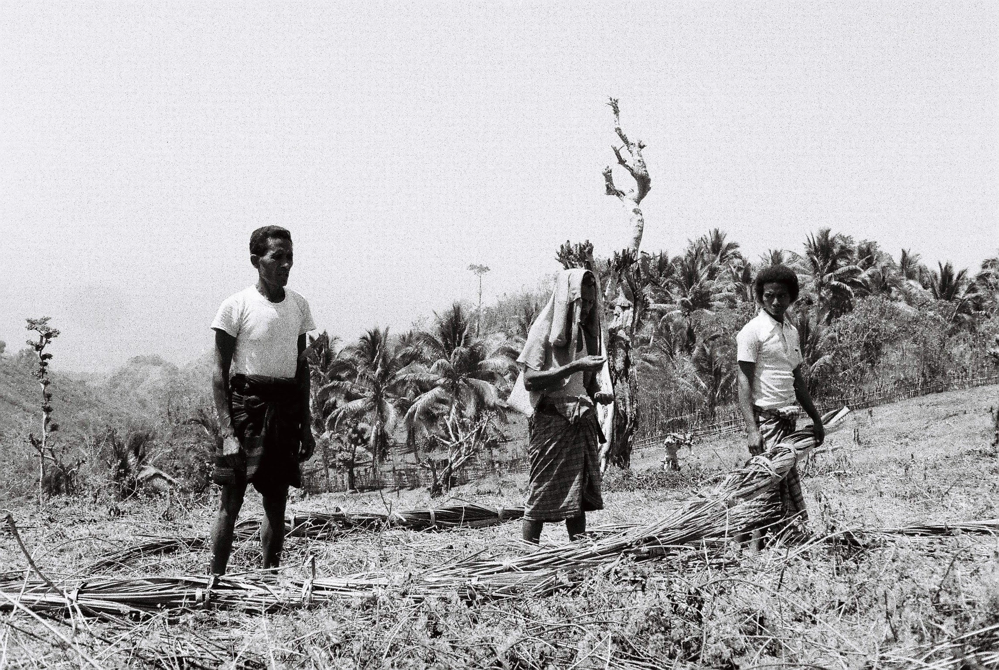
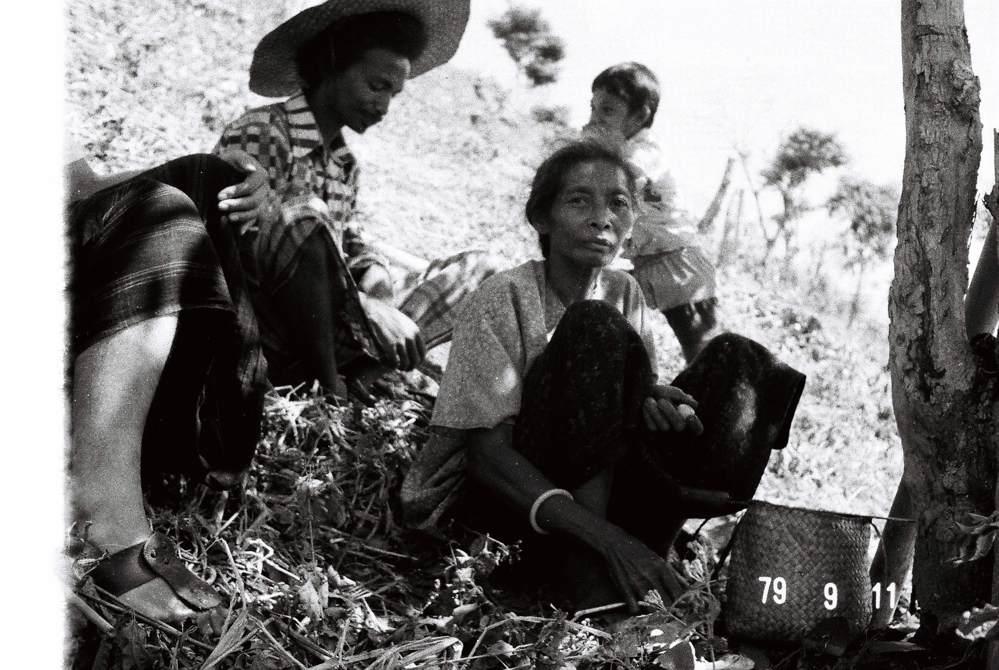
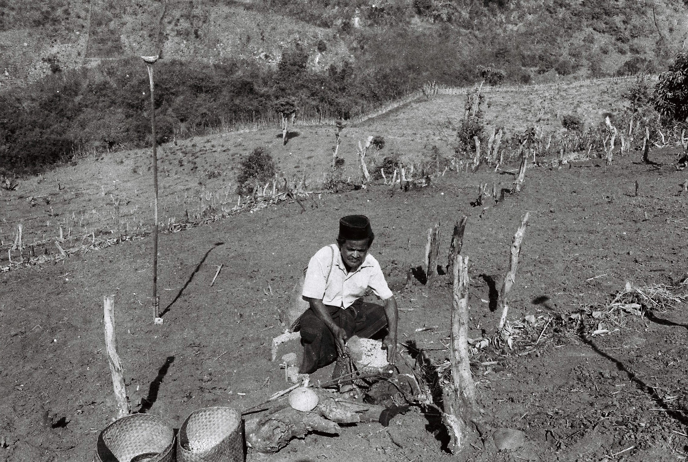
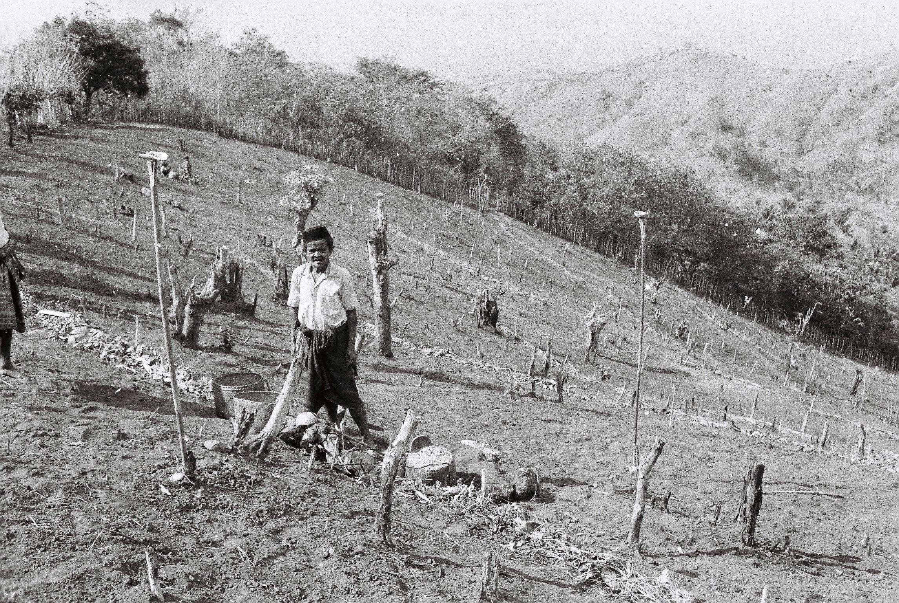

<!-- BEGIN:COLS -->

     kema tau kaa,
     kEwi tau minu,

     （エンデの儀礼詩より）

# 序

 エンデ民族誌の最初の講義は、
エンデの生業である焼畑耕作
*kema uma* （「焼畑で働く」）に焦点をあてます。[^subs]
それは食べるモノを得る活動です。
まず、簡単に「食べる」ことについて
説明しましょう。[^eat]
彼らの「主食」は何か、と聞かれた場合、
二通りの答え方があるでしょう。
ひとつは、いわば外側からみて、彼らが主として食べているもの（常食）を
調べてみるやり方です。
その場合、答えは、「キャッサバだ」[^cassava] ということになります。
しかし、内側からみて、彼女らがもっとも大切だと思っている
食物は何かということになると、それは米です。
客が来れば、必ず米の飯を出さなければ、ホストとして恥ずかしい、
それほどに米は「重要な」食べ物なのです。

[^subs]: わたしたちが最初にエンデの村に着いたのは
  1979年で、すでに40年以上の時間がたっています。
  その間に村はさまざまな意味で変化してきました。
  その内でもっとも顕著な変化は、生業のそれかもしれません。
  この章で描く「エンデの生業」は1980年代、90年代のそれ、
  すなわち焼畑耕作です。
  それはほぼ自給自足といっていいでしょう。

[^eat]: より詳しい説明は次の講義、[食べる](eat.html)でします

[^casssava]: キャッサヴァについては一口コラム[キャッサヴァ](cassava.md) を
  参考にしてください。

<!-- BEGIN:LIST -->
★ エンデの主食
- キャッサバ（常食）
- 米（主食）

<!-- END:LIST -->

 エンデの人たちの生業は焼畑農耕です。
焼畑とは、山肌の木々を焼き払い、
その灰を肥料として様々な穀物を育てる農耕の一形態です。[^uma]

- キャッサバ（常食）
- 米（主食）

[^uma]: 5年10年も休閑地としておいておければ、
  焼畑は「持続可能」な農耕です。
  ただし、休閑地としておいておけるのが数年であったら、
  土壌は回復できず、環境の破壊にいたることになります。
  隣のティモール島ではそのような状況が顕著であり、
  「ティモール問題」 と呼ばれました。

 雨期は１２月に始まり、種まきがなされます。
米ととうもろこしがもっとも重要な穀物ですが、
そのほかにさまざまな雑穀もまかれます。
種を蒔いてしまうと、食べ物がなくなり、
「飢餓の季節」 (**wurha mbepu**)  が始まります。
「飢餓」(**mbepu**) というのは「米に対する飢餓」であって、
キャッサバは一年中ありますので、なんとか食べていくことはできるのです。

<!-- BEGIN:LIST -->
★ エンデの農耕

- 焼畑農耕民である…焼畑とは
- 12月に雨季ががおとずれる
- 種蒔きの後に「飢餓の季節」が訪れる

<!-- END:LIST -->

 焼畑農耕は、単に彼女らの**胃の腑**を満たすための活動ではありません。
焼畑農耕は、区切りを様々な**儀礼**によってマークされた活動でもあります。
農耕は彼らの**精神世界**の中心をなす活動でもあるのです。

<!-- REM

これは注釈です。

-->

<!-- BEGIN:LIST -->

★ 焼畑農耕

- 焼畑農耕は胃の腑を満たすためだけではない
- 精神世界の中心をなす

<!-- END:LIST -->

# 農耕とエンデ人
<!--
エンデの人にとって、農耕はたんに
食べるものをつくるだけではありません。
それは環境との、祖先との、社会とのやりとりなのです。
-->

 エンデの人々は、自分たちの生活を、
次のように表現しています：
「食うために耕し//飲むために椰子をたたく」
と。

<!-- BEGIN:LIST -->
★ エンデの生きざま

- 「食うために耕し//飲むために椰子をたたく」

<!-- END:LIST -->

 カー・ウヴィによって、
人々は、一年の終わりを徴づけ、
そして、来年の種蒔のために絶対に必要な**呪米**（ボンギ）を、
受け取るのです。

 それでは、カー・ウヴィに始まり、
カー・ウヴィに終るエンデの（タナ・ゾゾの）**農耕カレンダー**を
ここに概観してみましょう。

 エンデの農耕カレンダーの特徴は
（おそらく、他の多くの焼畑農耕文化に共通するでしょうことでしょうが）、
技術的活動に、常に（いわゆる）儀礼的活動が付随していることです。
そして、これらの儀礼的活動は、
エンデの人々によってはっきりと何を「意味している」かが語られます。
それは、
精霊の慰撫、祖先への請願、
他人（妖術師）の妨害の阻止、
そして、米への語りかけと言ったテーマを持っているのです。
けっきょくすべてが豊作へと
つながるのです。

<!-- BEGIN:LIST -->
★ 儀礼の目的〜われわれの住む世界の他の住人

- 精霊（ニトゥ）の慰撫
- 祖先（アタ・マタ）への誓願
- 妖術師（ポゾ）の阻止

<!-- END:LIST -->

 かくして、農耕活動は、特に儀礼的活動は、
エンデの人々の生活世界の基本テーマの多くを表現することになるのです。
そこには、いってみれば彼らの「**宇宙観**」が現われていると
言えるでしょう。
それは、次のようにまとめることができると思います---
「我々の住む宇宙には、
人間とは別個に精霊（ニトゥ）、
祖先（アタ・マタ）、
そして妖術師（アタ・ポゾ）が存在し、
様々な形で我々に影響を及ぼすのだ」と。

 農耕儀礼は宇宙観だけを表現しているわけではありません。
それは、人間がどの様に組織化されているか、
すなわちエンデの**社会観**についても「語って」いるのです。
儀礼の中に、様々なレベルの共同体が表にでてくるのです。

<!-- BEGIN:LIST -->
★ 農耕儀礼の表現しているもの

- 宇宙観---ニトゥ、アタ・マタ、ポゾ
- 社会観---様々なレベルの共同体

<!-- END:LIST -->

 われわれの社会でも、儀礼は社会について「語り」ます。
たとえば、**小学校の運動会**では、「**校区**」という地縁共同体が
表にでてきます。
あるいは、神社やお寺の**お祭り**だと、
**檀家組織**というまた別の
地縁共同体が浮き上がります。
エンデの場合には、それが非常に体系的になされているのです。

 このような「語り方」は、
儀礼が宇宙観について「語って」いるのとはしょうしょう違います。
宇宙観については、エンデの人々がそのように言っているのです---
「この儀礼は精霊を慰撫するためだ」のように。
社会観の「語り方」は違います。
運動会の意味は、決して「校区をどうしたこうした」という
形で語られることはないでしょう。
そうではなくて、**運動会**は、私たちに、
校区という共同体について**思い出させて**くれるのです。

<!-- BEGIN:LIST -->
★ わたしたちの儀礼--運動会・お祭り

- 宇宙論（意識的）---仲良し、
- 社会論（無意識）---校区という地縁共同体
- 宇宙論（意識的）---
- 社会論（無意識的）---檀家という地縁共同体

<!-- END:LIST -->

<!-- BEGIN:LIST -->
★ エンデの農耕儀礼の「意味」

- 宇宙観（意識的）
- 社会観（意識的ではない）

<!-- END:LIST -->

 さて、エンデの連続した農耕儀礼の中に浮かび上がる共同体は、
（1）タナ（儀礼的共同体）、
（2）村（地縁的共同体）、
（3）父系氏族（血縁的共同体）、
そして（4）世帯（経済的共同体）です。
農耕儀礼はこれらヒエラルキカルに組織された社会を様々な形で、
エンデ人の経験の中に浮かび上がらせていくのです。

 土地は、ワジャと呼ばれる氏族が「所有」しています。
ワジャは父系のグループですから、たとえて言えば、
名字を同じにする「中川家」のようなものです。
ただし、
日本では、あなたの名字が「中川」だとして、
中川の姓を持つ親戚、すなわち父方の親戚は、
せいぜい、２・３世代くらいの深度（いとこ、はとこ程度）しかもちません。
しかし、エンデでは世代深度は１０代以上に渡るものです。
氏族については、別の講義 [「降りる」](descend.md)で詳しく述べますので、
今回の講義では、以上の理解で十分とします。

<!-- BEGIN:LIST -->
★ 二つの種類の土地

- 頭と尻尾をもつ土地
- それらを欠く土地

<!-- END:LIST -->

 土地には二種類があって、
ひとつは、「頭」と「尻尾」[^urhu] がある土地、
そして、もうひとつは、それを欠く土地です。
「頭」と「尻尾」のある土地は、儀礼がそれに付随しています。
そのような土地は、ワジャ、父系の氏族によって「所有」去れています。
「所有」にわざわざかっこをつけたのは、たとえば、
エンデでは、たとえ「所有者」であっても、その土地を売ることは
できないとされている、といういくつかの（日本語の「所有」と）
相違する点があるからです。
エンデの人は言います---
**kema tau kaa // kEwi tau minu**
「（土地は）耕して食べるため、
椰子をたたいて、飲むため」にのみあるのです。
決して「売って」はならないのです。

[^urhu]: 「ウズ」と「エコ」といいます。

 さて、土地の話を長々と書いてしまいましたが、
現在の脈絡で私が述べたかったことは、単に、
他人の土地で農耕をする場合についての「支払い」です。
焼き畑は一年毎に次の土地を探さなければなりません。
[ **under construction **  ]

 これから述べるさまざまな儀礼的活動は、
耕作者みずからが行なうこともあれば、
儀礼専門の人間（**アタ・マジ**、「呪医」と訳す）に依頼する
こともあります。
すなわち、
一つの畑にそれにかかりきりの呪医が存在することになるわけです。
呪医と耕作者の関係は、
自由契約と呼ぶことができるでhそう。
収穫が思わしくなければ、次の年は別の呪医をさがすことは
ごく普通に行われることです。
「去年は、儀礼をしたが、
収穫が思わしくなかった。
今年は神父に聖別された水を使うことにしたよ」と言っている人もいました。

 呪医に対する報酬は高いものではありません。
収穫のごく一部が彼に与えられるだけです。
尤も、呪医は（日本で想像する）専門家ではありません、
彼の生活は彼自身の畑によっているのですから。

# カキ、森の開墾
<!--
ここでは最初の活動、
カキについて述べる。
-->

 焼畑農耕は、まず森の開墾（**ガガ**）から始まります。
森は人に害をもたらす精霊たち（ニトゥ・パッイ）の住処です。
村は人間の持ち物です。
しかし、森や、森にあるものは、「**ニトゥの持ち物**」です。
人間は、いわばニトゥ・パッイの持ち物をうばいとって、
人間の持ち物、畑（ウマ）にするのです。
まず、精霊たちに**挨拶**をすることから始めなければならない、
とエンデの人は語ります。
それは**カキ**と呼ばれる儀礼によってなされます。

<!-- BEGIN:LIST -->
★ 焼き畑とは

- 村は人間の持ち物
- 森は精霊の持ち物
- 畑は、精霊の持ち物を、人間の持ち物にする
- そのために、精霊に挨拶をするのが、カキ儀礼だ

<!-- END:LIST -->

畑を焼きます---大きな仕事はソンガ（共同作業）で行います)
耕作者は、
自分の今年耕作する予定の場所へ行き、しるしをつけて、
自分の区画を確定します。
その（将来の畑の）中央付近、やや下よりの部分は特殊な場所となります。
ここ（後にマタ・ンギアとよばれる
**祭壇**が作られるのですが）は、
いわば畑全体の**ミクロ・コスモス**となるのです。
耕作者は、ここで、森の開墾の真似ごとをします。
「大きな音を出して精霊を脅かしてはいけない。
眠っている精霊を、少しづつ起こすように、行わなければならない。」

 そして、
その場所に、カー・ウヴィで受け取った**呪米**を埋めるのです。

 次に、
耕作者（あるいは呪医）は、
予定の区画の**四隅**から土をひとにぎり家に持ち帰ります。
この土は種蒔の時まで厳重に管理されます。
かくして、（エンデ人によれば）
「だれも、俺の畑を妨害（ウォゼ）できない」のです。

<!-- BEGIN:LIST -->
★ カキのやり方

- 区画の中央やや下よりの部分で開墾のまねごとをする
- 呪米をうめる
- 四隅から土を取り、家に保管する

<!-- END:LIST -->

 儀礼の**釈義**（儀礼の意味を説明すること）というのは
なかなかおもしろいものです。
いくつかの釈義は、たしかに全員に共有されているのですが、
ときどきは、村の中でも「あいつの言うことは信じるな」という
ような出来事があります。
インフォーマントの一人、彼は呪医で、かつて、
狂気を経験しているのですが、
次のように言いました：
「呪米は、去年の米だ。
古い米が、新しい米に『いらっしゃい』
と挨拶するようなものだ」と。
私の「お父さん」であるバパ・ロベさんは、
「あいつの言うことは勝手に作った話だ。
相手にするな」と言っていました。
釈義の食い違いについて考えると、またおもしろい問題になるでしょうが、
ここでは、カキの際の呪米の取り扱いについて、
そのような解釈もあることだけを付け加えておきます。

 かくして、耕作者は精霊に予告をする（中央での開墾の真似ごと）と同時に、
精霊による畑に対する妨害を阻止する（呪米）のです。

<!-- BEGIN:LIST -->
★ カキの釈義

- 精霊に挨拶する
- 古い米（呪米）が新しい米を呼びよせる
- 他人（妖術師）が妨害できないようにする
- 他の人に「ここは私の畑の予定地だ」と知らせる

<!-- END:LIST -->

 この様な儀礼的措置をとった後で（具体的には翌日から）、
**開墾**が始まります。

<!-- END:COLS -->

![女たちも貴重な労働力][/~satoshi/anthrop/pict/cl-085/image002.jpg]
![燃え残りの切株を引き抜きます][/~satoshi/anthrop/pict/cl-085/image005.jpg]

![][/~satoshi/anthrop/pict/cl-085/image003.jpg]
![畑を焼きます---大きな仕事はソンガ（共同作業）で行います][/~satoshi/anthrop/pict/cl-085/image001.jpg]

<!-- BEGIN:COLS -->

# ソンガ

 開墾はもっとも骨のおれる作業です。
しばしば、
**ソンガ**と呼ばれる共同作業がなされます。

 ソンガの前夜、
ホストの家族の若者一人あるいは二人が、
ソンガに来てほしい人々の家を一軒一軒尋ねます。
若者は家の前にたち、大きな声で、
「アベ！**レッタオネ**！ 
おおーい、中にいる人たちよ！」と呼び掛けます。
中にいる人が、若者を招き入れます。
たばこが供され、若者と家の人はしばらく世間話をします。
しばらくしてやっと、「カウ・マイ・タウ・アパ？なにしに来たのだ」と
家の人が聞きます。
[ **under construction ** ソンガの一日 ]

<!-- BEGIN:LIST -->
★ ソンガの一日

- （前夜）ンバナ・サンブ---「アベ・レッタ・オネ」〜しゃべり
- ドーヴェその他
- 昼食〜少なくとも鶏
- 仕事
- 帰宅
- 夕食〜豚（サンガ・ワヴィ、ザンビ、ナス）

<!-- END:LIST -->

# 火入れ

 森の開墾が終った後、
畑はしばらく乾燥させられ、
**９月の中旬頃**、**火入れ**（ジュンギ）が行われます。

 火入れや種まきの
タイミングをみはからうには熟練を要します。
火入れの季節、人々は、
「誰某がもう畑に火入れをしたぞ。
まだまだ最初の大雨が来たばかりなのに」等々、
火入れのタイミングについて語り合います。
とにかく、最初の雨がやってきて、おお慌てで火をいれる人はいません。
[ **under construction ** 火入れのタイミング ]

 火入れの際には、また**呪医**が呼ばれます。
呪医は、さまざまな植物を束ねたものを用意します。
それに呪文を施します。
家をでる際には、前後左右に呪米を蒔いたのち、
残った呪米を**竹笛**の中にいれます。

 人々は畑に到着すると、
畑の真ん中辺りに**火**をつけます。
火をつけるのは誰でもいいのですが、
その人は**赤い服**を着ていなければいけません。
呪医は、畑の真ん中のあたりにたたずみ、
ふたたび**呪米**を前後左右にまきます。
**米と生姜**を口に含み、火にむかって、それを吐き出し、
先ほどの**植物の束**で火の前後左右の地面をたたき、
そして**竹笛**を吹きます。
一方、さきほど火をつけた人間は、
坂の上にむかって、畑の一番上の端まで走っていきます。

<!-- BEGIN:LIST -->
★ 火入れ
- 前夜---水をとらない
- 火をつける人は赤い服を着る
- 呪医は竹笛を吹く
- 火をつけた人は坂の上までかけあがる

<!-- END:LIST -->

<!-- END:COLS -->

{width=4cm}
{width=8cm}
{width=30%}

<!-- BEGIN:COLS -->

これらの行為は、簡単に説明をされます。
赤い服は「火が友達だと思うように」、
畑の上の方に走るのは、「火が彼を追いかけていくように」、
そして、
竹笛をふくのは、「風を呼ぶ」ためなのです。

<!-- BEGIN:LIST -->
★ 火入れの儀礼の意味

- 水をとらない---火がつきやすいように
- 赤い服---火が友だちだと思うように
- 竹笛を吹く---風を呼ぶために
- 坂の上までかけ上がる---火がついていくように

<!-- END:LIST -->

 カキの儀礼の釈義が、
エゾテリックであったのに比べ、
火入れの際のさまざまな行為の**釈義**は、
あからさまに「**自然な**」ものです。
いってみれば、エンデのことを知らないと、
カキの釈義は納得ができないのですが、
エンデのことを知っていなくとも、
火入れの儀礼の釈義は納得してしまうのです。

 カキは、ガガ（開墾）にともなう儀礼です。
火入れの際に行なうさまざまな「象徴的な」事象には、
特別な名前はついていません。

# パ・モポ、デッラ

 火入れの翌日からは、
儀礼を伴わない（燃え残った木を再び焼く、
水止め（アペを作る等々の）
「**技術的な**」活動が続けられます。

 １０月頃から雨は降り始めます。
実際に畑に**種蒔**が行われるのは、
**１２月頃**となります。
種蒔の前日に**パ・モポ**と呼ばれる儀礼が、
畑でとり行われます。
「パ・モポ」という言葉の意味を尋ねたのですが、
誰も答えられませんでした。

 **呪医**が再び呼ばれます。

 パ・モポの特徴は、
**料理**に関する意味論に連結していることです。
カキにおいて、精霊と人間との対立が表に立ったように、
パ・モポにおいても、その対立が儀礼の中で強調されます。
料理は自然に対して文化を象徴するに適したものです。
エンデにおいての**文化的な料理**とは、
（村落内の）
家で調理され、かつご飯は「炊かれ」（ペッデ）、
おかずは「煮られた」（ナス）ものです。

<!-- BEGIN:LIST -->
★ 料理の体系

- カー（ごはん）─炊く（ペッデ）
- プサ（おかず）─煮る（ナス）

<!-- END:LIST -->

 私は魚は焼いたものが最もおいしいとは思うのですが、
エンデの人に頼むと、なかなかいい顔をしてくれません---
「焼いたものは、子どもの食べ物だ」と。
それほど、「**煮る**」ことは大事な料理法なのです。

 パ・モポの料理は、いわば「**野生**」の料理なのです。
それは（村落外の）畑で調理され、
ご飯もおかずも「焼かれた」ものなのです。
エンデ風に言えば、それは「人間」の料理ではなく、
「精霊」の料理なのだ。

<!-- BEGIN:LIST -->
★ パ・モポの意味論---料理

- 文化の料理---家の中、煮たおかず、炊いたご飯
- 野生の料理---村の外、焼いたおかず、焼いたご飯

<!-- END:LIST -->

 より具体的に言えば、
パ・モポは呪医によって、
畑の中央で行われる**竹筒**による料理です。
一本の竹筒に米、
もう一本の竹筒に鶏などを入れ、
そのまま火にくべるのである。

<!-- BEGIN:LIST -->
★ 局地的な釈義---熱いと冷たい

- とうがらし等の熱い香辛料は使ってはならない
- 火を使った後の畑は水をかけて冷たくする

<!-- END:LIST -->

 エンデの人によって、
パ・モポに対する全体的な釈義は与えられません。
（いわば）局地的に、「熱い」対「冷たい」の対立が語られます。
原則は、畑は「冷たく」されていなければならないということなのです。
それゆえ、「熱い」食べ物である香辛料（例えば「とうがらし」等）は
パ・モポには使ってはならないといいます。
また、料理に使う「火」は畑を「熱く」してしまいます。
ですから、呪医はココ椰子の水を使って、料理の跡を「冷たく」します。

<!-- END:COLS -->

{width=40%}
{width=40%}
{width=40%}

<!-- BEGIN:COLS -->

 この日、畑では、
共同耕作者たち（開墾まで）の間での
畑地の分割（ザンギ）が行われます。
種蒔は、この分割された畑地に、
それぞれが行うことになるのです。
すなわち、共同耕作を行っていた諸世帯は、
これより、儀礼的には一体ではあるが、
経済的には分離することとなるのです。
種籾は世帯ごとに供出し、収穫も世帯ごとに管理することとなります。

★ その夜、家で行われる儀礼---デッラ

- 祖先への供儀
- さらに麗々しく盛られたごはんとおかず
- パ・モポが「野生」なら、デッラは過剰なまでの「文化」を
料理で表現している

...

 その夜、家で**祖先**（アタ・マタ）への
供物（デッラ ）がとり行われます。
デッラの供物は、
皿に盛られたごはんとおかずよりなります。
パ・モポが、普通の料理の「野生」への変換だとすれば、
デッラは過剰に正式な（「文化的な」）料理と言えます。
ご飯とおかずは、正式に料理されるだけでなく、
ことさらに**麗々しく**器に盛りつけられます。
呪医は、デッラを前にして、**儀礼歌**を唱え、
祖先を呼び出し、供物を食べることを要請します。
そして、私たちは豊作を彼ら祖先に願うのです。

★ 精霊／祖先

- 精霊への料理（パ・モポ）---野生の料理
- 祖先への料理（デッラ）---これみよがしな文化の料理

...

# 種まき、マタ・ンギッア作り

 デッラの翌日、**種蒔**（トゥンド）が行われます。
種蒔は、
エンデのそのほかの儀礼に何度も現われる
「道行」のモチーフをもって語られます。

## 境界の魔力

 この道行きの中で大きな意味を持つことになる
**境界**について、一般的な議論を紹介しておきます。

 人類学において、境界が注目されたのは、
分類との関係においてでした。
背景にあるのは、
「人間は、曖昧模糊とした現実の中に、
線を引き分類をしていくことにより、
世界を把握することができるようになった」という考え方です。

 分かりやすいので、よく例に出されるのは、虹です。
虹は光が波長の長さによって分光されて見えます。
日本では、「虹には７つの色がある」と言います。
[^FN-2]
しかし光の波長の分布にすきまがあるわけではありません。
じっさいは、虹は内側の赤から外側の紫にかけてじょじょにじょじょに
色が変わっていっているのです。
連続体の中に（**恣意的な**）境界線がひかれているのです。
７つの色が**ある**のは自然・世界の中ではなく、
私たちの**見方**のなかにあるのです。

<!-- BEGIN:LIST -->
★ 境界の重要さ

- 連続体に線引きをする：分類
- 虹の例

<!-- END:LIST -->

 さて、線の向こう側は、たとえば、「赤」、
線のこちら側は、「橙」としましょう。
問題は、「**線は何色？**」ということです。
それは赤でもなければ、橙でもありません。
分類を行なうために引いた線が、
その分類を成り立たせない原因となってしまったのです。
そこで、（と人類学者は語りますが）その線に禁忌が課せられる
ようになったのです。

<!-- BEGIN:LIST -->
★ さまざまな境界の禁忌

- 敷居を踏んではいけない
- 逢魔が時（王莽が時）
- クー と妊婦・子供
- 「恐怖の季節」：年と年の間（メアリ─・ポピンズ）

<!-- END:LIST -->

 たとえば、「敷居を踏んではいけない」というタブーは
おそらくかなりの人が聞いたことのあるタブーではないでしょうか。
これは、「部屋の外」と「部屋の内」との分類を乱す行為でるがゆえに、
禁忌が課せられているのです。

 幽霊はいつ出るかご存じですか？
丑三時（午前２時から２時半くらい）という答えもあるかも知れませんが、
逢魔が時（たそがれ時）です。
これは、昼でもなく、夜でもない時間なのです。
「王莽が時」という当て字がこの時間帯の性格をよく表しています。
王莽は前漢の末に王位を簒奪し、新という国を作りました。
が、すぐに反乱が起き、漢が復興したのです（後漢）。
すなわち、王莽は前漢でもなく、後漢でもない、境界の王なのです。

 開墾は、ニトゥのもちものである森を開いて、
人間のもちものである畑（ウマ ）を作るものであると述べました。
収穫が終わると、ウマは放置され、じょじょに森に戻ります。
収穫の終わったばかりの畑のことを**クー**と言います。
クーは、そのまま放置されることもあれば、
翌年（開墾よりは収穫は期待できないが、
作業がやさしいので）もう一度焼畑として使われることもあれば
（ジョー・クー といいます）、
また、常畑（コポ ）にすることもあります。
ともかく、クーは、人間のもちものでもなくなったが、
まだ精霊の持ち物にもなりきっていない**あいまいな**領域なのです。
クーはそれゆえ禁忌に満ちた場所であり、
弱い存在、危険にさらされやすい存在、妊婦や子どもは、
クーに入ることを、とくに**たそがれ**時
[^FN-3]
には、強く禁止されます。

 また、クーの季節とは、
言ってみれば、前の年でもなく
（すでに収穫、カー・ウヴィは終わってしまっています）、
かといって、次の年でのない（まだ開墾は始まっていません）、
曖昧なときです。
この時、首狩をする男たちが、村々を徘徊するという
言い伝えがあります。
**恐怖の季節**です。

 このように境界というのは、
禁忌に満ち、それゆえに、不思議な力をもった時間・場所なのです。
そういえば、たしか、
**メアリー・ポピンズ**が子供達のところにやってきたのも、
前の年でも、次の年でもない、
教会の鐘が鳴り響いている魔法の時間でした。

## 種まき

 さて、種まきの話に戻りましょう。

 畑は、もちろん、村の外にあります。
これまで何度も通った**村と畑**の「みち」が
にわかに意味を帯びてくるのです。
あるいは、村の内と外の区分が、
と言い替えたほうがいいかもしれません。
この境界はいままで何度も越されたものです。
しかし、この日初めて重大な意味を担わされることとなるのです。
それは、「文化」と「野生」がパ・モポにおいてそれとなく対比されたことに
通じるのかも知れなません---
しかし、エンデ人たちは、特に釈義を、意味を語ってはくれません。

 夜明け前、
**女たち**が種蒔に使う米を籠に詰め、
出発の用意を整えます。
女たちが（技術的、儀礼的）農耕活動の表舞台に出るのもこれからなのです。

 村の境界に**灰**が撒かれます。
彼女らが**村の境界**を越えることが視覚的に徴づけられたわけです。
村の境界を越えた彼女たちは、すなわち、
撒かれた灰を越えた後の彼女たちは、
「水浴をした後のように清潔に、マッサージをした後のようにきらきらと」
していると、ことさらに語られます。

 女たちの後に男たちも出発することとなります。

<!-- BEGIN:LIST -->
★ マタ・ンギッアでの儀礼

- 特定の種類の木でマタ・ンギッア（祭壇）をつくる
- 呪医による目をつぶっての種まき：芽を出さない
- 精霊への供儀
- 髪をふりほどいた処女による種籾の分配

<!-- END:LIST -->

 焼畑につくと、これまでの儀礼に何度も登場した例の中央の部分に
**マタ・ンギッア** とよばれる祭壇が作られます。
それは、特定の種類の木で作られた単なる木の枠組みにすぎません。
呪医はそこに座り、目をつぶって、竹を使って、種蒔をします。
ここに撒かれた種は決して芽を出すことはない、とエンデの人は言います。
様々な供儀が、精霊に対して供えられた後、
**処女**が、呪医に代わり、**マタ・ンギッア**に座ります。
彼女は通常はひっつめていた**髪**を長く垂らしたままにする。
そして、彼女の前に籠がおかれます。
籠に籾が注がれ、彼女は籾を一粒摘み、咀嚼し、また籠に吐き戻します。
この籠から種蒔のために各人が籾を受け取るのです。
処女は種蒔の間中マタ・ンギッアに座り、籠がからになれば、
また同じことをして、籠に籾を補充します。

<!-- BEGIN:LIST -->
★ マタ・ンギアでの儀礼

- マタ・ンギア（祭壇）が作られる
- 呪医が目をつぶった種蒔きをする---けっして芽を出さない
- 供犠が精霊に捧げられる
- 処女が座る
- 髪を長く足らす
- 籾を咀嚼し、籠に戻す
- その籠からみなが籾を取り、種蒔きをする

<!-- END:LIST -->

<!-- BEGIN:LIST -->
★ マタ・ンギッアの意味

- （かつて）畑のミクロ・コスモス＝「畑の中の畑」
- （この場面）森のミクロ・コスモス＝「畑の中の森」

<!-- END:LIST -->

 ここに現われるのは、
パ・モポの日以来前面に押し出されてきた
**精霊**（自然、野生）と**人間**（文化、村）との間の
一種の**バランス**の原理なのです。
マタ・ンギッアは畑のミクロ・コスモスであることは、
既に述べました。
それは、しかし、文脈いかんによって、
逆転したミクロ・コスモスともなるのです。
マタ・ンギッアは畑の中の畑だが、
畑が自然（森）の中に突然侵入した文化であるように、
マタ・ンギッアは文化（畑）の中に侵入した自然（森）でもあるのです。
マタ・ンギッアの不毛性（芽を出さない籾、処女）は、
マタ・ンギッアの表わす畑の豊饒を保証するのです。
**精霊**が「**よくない**（レッエ）もの」を請け負うことによって、
**人間**に「**よき**（リッア）もの」がもたらされるのである。

<!-- BEGIN:LIST -->
★ 精霊と人間のゼロサム・ゲーム

- マタ・ンギッア（精霊＝野生）の不毛さは、
	畑（人間＝文化）の豊穣さを約束する

<!-- END:LIST -->

 **ゼロ・サム・ゲーム**と言ってもよい上記の原理は、文化と自然の
間だけに働く原理ではありません。

<!-- BEGIN:LIST -->
★ 妖術師（アタ・ポゾ）とは

- 邪悪を行う存在
- 恨む、病い、死、死肉食
- 誰かは分からない＝＝ヒソヒソ声の噂

<!-- END:LIST -->

 人間社会の中に、
社会に**邪悪**に働くことのみをその存在理由とするような人間がいると
エンデの人々は言います。
彼らは、他人をちょっとしたきっかけで妬み、
超自然的力を以て彼（女）を襲い、病におとしいれ、死に至らしめるのです。
そして彼らは彼らが殺した死者の死肉を食らうのです。
その様な人間を、**アタ・ポゾ**（妖術師）と言います。
誰が妖術師なのかは、社会生活の中ではわかりません。
あるのは**噂**だけなのです。

<!-- BEGIN:LIST -->
★ 妖術師あれこれ

- ンガエ・プッウの事例：「塩をくれ」（因縁？）
- 「あのうちにいってはいけない」：食事の毒

<!-- END:LIST -->

 私が食事によばれ、みなといっしょにごはんを食べているところに、
村のある人間が**塩**を借りに来ました。
「塩はないよ」とそのうちの主人が言うと、彼は帰っていきました。
しばらくたった後、そのうちの主人が言いました---
「彼は**きっかけ**をさがしにきたんだ」と。
妖術師は、つらくあたられたこと（たとえば、
「塩がないよ」と追い払われる）などをきっかけにして、
「人に災いをもたらす」（**タウ・アタ**）のだそうです。
なんとなく、やくざの「因縁をつける」論理を思い出させますが、
なんだか不思議な論理でした。

 また別の日には、私が情報を仕入れにいったうちで、
そのまま食事を呼ばれたことがありました。
自分のうちに帰ってくると、
バパ・ロベさん（私のおとうさん）が、心配そうな声で言いました---
「あの家にいってもいいのだが、食事は絶対にとってはだめだ」。
妖術師のよく使うやり方は、食事に**毒**をいれることなのです。

<!-- BEGIN:LIST -->
★ 妖術師と精霊の類似の一例

- 精霊と人間のゼロサムゲーム（マタ・ンギッアの凶作）
- 凶作の災因論---クル（私の凶作、他人の凶作）

<!-- END:LIST -->

 様々なエンデのイディオムにおいて
「妖術師（アタ・ポゾ）」という語と「精霊（**ニトゥ**）」語とは、
しばしば入れ替え可能の様相を呈しています。
そして、人間と精霊との間で成り立っていたゼロ・サム・ゲームは、
人間と妖術師の間でも成り立つのです。

<!-- BEGIN:LIST -->
★ 妖術師と精霊の入れ替え可能性

- しばしば精霊と妖術師は入れ替え可能である
- 人間と精霊の間のゼロサムゲームは、人間と妖術師の間にも成り立つ

<!-- END:LIST -->

 エンデの人が、
凶作（社会全体の凶作ではなく、自分の畑だけの凶作）の**災因論**として
最も頻繁に採用するのは、
他人（妖術師が含意される）による収穫の「**盗み**」です。
収穫を盗むのは、「**クル**」と呼ばれる呪術的所作によって
達成されると考えられています。
秘義的釈義は別にして、「クル」は名前の表わすように、
「クルルルル．．．」と唱えながら、
手のひらを上にして、呼び寄せるような動作をすることです。
必要な力を持っている人間がこの所作をすれば、
「富（バンダ）」が彼女の所へ引き寄せられるのです。
自分の畑の凶作（マイナス）は、
誰か（妖術師）の畑の豊作（プラス）を意味しているのです。

 上に私は、
「妖術師」という語と「精霊」という語が、
しばしば入れ換え可能だ、と言いました。
「**妖術師**」という語と、「**呪医**」という語も、
違った意味でなのですが、似ています。
それは、実際にイディオムの中で入れ換え可能である、ということを
言っているのではありません。
しかし、「妖術師」に対する形容詞群と、
「呪医」に対する形容詞群は多く一致するということを示したかったのです。
じっさいの所、妖術師と呪医の違いは、前者が「悪」であり、後者が「善」である、
という点だけにしか存しない、と言っても言い過ぎではないほどに、
両者のイメージは重なり合っているのです。
妖術師の力の一つである「クル」能力は、
当然のことに呪医にも備わっています。

 **呪医**は、種蒔の一日の後にマタ・ンギッアに座り、
「**クル**」を行います。

 クルという同一の行為が、
妖術師が行えば、
他人の凶作を願って行う邪悪なものとされ、
呪医が行えば、自分の豊作を願って行う良き行為とされるのです。
尤も、ときどき、エンデの人は次のように言います---
「**豊作**を得るためには、
**妖術師**のごとくふるまわなければならないのだ」と。

<!-- BEGIN:LIST -->
★ 妖術師と呪医

- クルー：妖術師が行うと悪い
- クルー：呪医がやると、農耕儀礼
- 豊作を得るためには、妖術師のごとくふるまわなければならないのだ

<!-- END:LIST -->

![エンデの焼き畑は急な斜面にあります][/~satoshi/anthrop/pict/cl-084/image003.jpg]
![堀棒をつかって種をまきます
][/~satoshi/anthrop/pict/cl-084/image006.jpg]

![子供が村からごはんを運んでくる][/~satoshi/anthrop/pict/cl-084/image024.jpg]
![昼休みです][/~satoshi/anthrop/pict/cl-084/image017.jpg]

[ **under construction ** ここから先、「ですます調」になおしていない。 ]

# とうもろこしと稲の収穫

 種蒔が終ると、
様々な仕事が耕作者を待ち受けています。
しかし、儀礼的活動を伴うものは、ごくわずかですし、
その儀礼もそれほど重要性を与えられてはいません。
作物の順調な生育を願い、
他人（妖術師）の妨害（ウォゼ）を防ぐことがこの期間の儀礼の主目的です。

 重要な儀礼は**４月**を待つこととなります。
とうもろこしは既に熟しています。
しかし、**プサ・ウタ** 
 （「おかずを食べる」）の儀礼が行われるまでは、
とうもろこしを「煮る」（文化的な料理）ことは禁止されているのです。
とうもろこしを「焼く」（正式な料理ではない、
パ・モポの時の様に「野生」の料理である）のはかまいません。

 次に、**５月中旬**頃、稲に対して、
収穫の禁忌を解く儀礼（**ヌテ・ピソ**
）が行われます。

<!-- BEGIN:LIST -->
★ 三つの儀礼

- プサ・ウタ---とうもろこしの儀礼
- ヌテ・ピソ---米の儀礼
- カー・ウヴィ---ヤムイモの儀礼

<!-- END:LIST -->

 プサ・ウタとヌテ・ピソ
（あるいは「とうもろこしの儀礼」と「米の儀礼」とも呼ばれる）、
および次節で説明する**カー・ウヴィ**、「ヤム芋を食べる」儀礼は、
次のような共通の枠組みで説明ができます。

 これらの儀礼はある穀物（Ｃ）に対する、
ある特定の人々（Ｐ）の禁忌を解く儀礼である。
実際の儀礼のシナリオは、ある人物の
（呪医の場合もあり、
また、Ｐの中の一人の場合もあるが）畑への往復行よりなる。
この旅程は、
種蒔の時と同様に儀礼的に徴づけられる。
通常は、**二重の境界越境**が徴づけられる。
第一は「**家**」の内／外であり、
第２は、「**村**」の内／外である。
徴づけは、**銅鑼**のなる中の出発とい
う場合もあるし、また通常は**出入りに用いない穴**（「窓」など）を用
いての出発、帰還という形で表わされることもある。この畑への往復
行によって、Ｃが村の中へ、家の中へもたらされる。このＣを、呪医
が特別なやり方で、Ｐの成員に食べさせるのである。Ｃが家の中に持
ち込まれて以来、家屋は儀礼的に危険な領域となり、家屋の外とは厳
格に区別される。人の出入りは禁止され、家屋内は絶対の沈黙が支配
する。この後、Ｃの一部が床の下に（エンデは高床式の住居である）
おとされ、大きな音が鳴らされる。すべての禁忌が解かれたのだ。Ｃ
に関する禁忌もなくなり、また家屋内を支配した様々な禁忌も解かれ
る。

<!-- BEGIN:LIST -->
★ 三つの儀礼の共通枠組み

- ある穀物（C）に対する
- ある特定の人々（P）の禁忌をとくことを目的とする
- Pの一人の（C のある）畑への往復
- 家の家外（さまざまな禁忌）
- 村の家外

<!-- END:LIST -->

 プサ・ウタもヌテ・ピソも禁忌のおよぶ範囲Ｐは世帯員である。
父系性は、この禁忌の範囲を広げる、と積極的に述べられはしない。
しかし、ＡとＢが父系的に関係している場合、Ａは、たとえＢと同世
帯ではなくとも、まだ禁忌のあけていないＢの畑に産したとうもろこ
し、あるいは米を食べないほうがいい、という。

<!-- BEGIN:LIST -->
★ 三つの儀礼の社会構成

- プサ・ウタ：P---世帯
- ヌテ・ピソ：P---世帯

<!-- END:LIST -->

# カー・ウヴィ

 **カー・ウヴィ**は、既に述べたように、
タナ・**ゾゾ**の農耕儀礼サイクルのクライマックスである。

<!-- BEGIN:LIST -->
★ カーウヴィの構造

- Ｃ---ヤム芋
- Ｐ---これが問題である

<!-- END:LIST -->

 カー・ウヴィを先ほどの枠組みに即して言えば、Ｃは、「ヤム芋」
である。問題はＰである。カー・ウヴィは、プサ・ウタやヌテ・ピソ
とは違った形で、Ｐを表現する。それは前二者とは違って、複数の次
元を持ち、各次元で、対象となる人間の範囲が異なっているのである。
そして、それらの次元の移行によって、巧妙にタナ・ゾゾの「社会構
造」を表現するのである。

 第一にカー・ウヴィはタナの儀礼である。カー・ウヴィを行う順
番は決められている。第一の村がカー・ウヴィを行うと、続いて、第
二の村がそして第三の村が、と続き、一カ月から、二カ月の間にカー・
ウヴィはタナを「めぐる」。かくして、カー・ウヴィは**タナ全体**を徴
づけるのである。

 実際にカー・ウヴィを行うのは、村である。村は、カー・ウヴィ
の行われる間、禁忌に包まれる。ちょうど、プサ・ウタやヌテ・ピソ
の間、各「家屋」が禁忌に包まれるように。村の入口には、特別な徴
が立てられ、数日間、**村**は「**閉じられる**」。
この期間に当該の村への
出入りは禁止される。かくして、カー・ウヴィはタナの構成単位であ
る村を徴づける。

 各村のカー・ウヴィにおいて、**二種類の食事**が供される。一つは
「**儀礼的な**」食事である。
食べられるものはヤム芋であり、これを食
べることによって、禁忌が解かれるのだ。もう一つは、儀礼の終った
後、村人全員によって食べられる「**公共の**」食事である。これは米の
ご飯よりなる。後者の食事に禁忌はない。
「儀礼的」な食物であるヤ
ム芋は、**ムボロ**と呼ばれる籠に入れられ、
各**父系氏族**で一つ用意する。
また、「公共の」食物である米は、ワティと呼ばれる籠に入れられ、
各世帯で用意される。かくして、カー・ウヴィは、一方で村の構成単
位である氏族を、また一方でその氏族の構成単位である世帯を徴づけ
ることとなるのだ。

<!-- BEGIN:LIST -->
★ カーウヴィにおいてあらわれる共同体

- タナ（儀礼共同体）：タナ・ゾゾの中の村から村へと儀礼が運ばれる
- ヌア（村---地縁共同体）：村の尻尾と頭に禁忌の印、儀礼的に
	閉じられる
- ワジャ（血縁共同体）：ンボロのヤムイモを供出する
- サッオ（家---経済共同体）：ワティの飯を供出する

<!-- END:LIST -->

# 農耕とエンデ社会

 エンデの人々は、
「生きるための」活動を農耕に頼っているという意味だけでなく、
生活世界全体を統合する**象徴体系**を農耕が表現しているという意味で、
「農耕民」だと言えるのです。
カキから種蒔を通じて、
彼女らは**超自然的**な様々な力
（**精霊**、**祖先**、**妖術師**）を、
彼女らの原理に則して制御しようと試みます。
また、収穫の儀礼を通じて、
彼らは自らの象徴的「**社会構造**」を再確認するのです。

# もっと勉強してみたい人のために---独断と偏見の文献ガイド

 この講義の背景にあるのは、
人類学の構造主義の考え方です。
構造主義の入門書がいくつか出版されているようですが、
私はひとつも読んでいません。
新書判のものが多いのでたいした出費ではないでしょう。
損を覚悟で買ってみてらどうでしょうか。

 人類学の構造主義の泰斗、レヴィ＝ストロースの本は
すべてがお奨めです。
どうしても一冊だけ選ぶならば、私は、『野生の思考』
([@ls-pensee-j])（★★）を選びます。

 人類学の構造主義の源泉は、
言語学の構造主義です。
ヤコブソンの([@jacobson-j-1977])（★★）は、
言語学プロパーの本ですが、
どんな構造主義入門の本よりも、
[^FN-4]
やさしくわかりやすく構造主義について書いています。

 この講義の裏のテーマは、儀礼の釈義です。
「儀礼の意味」とは何なのでしょう。
[ **under construction **  ]

# References

[^FN-1]: 不思議なことですが、
ヤム芋は、（キャッサバのような）常食でもなければ、
（米のように）日常的に「だいじにされている」わけでも
ありません。

[^FN-2]: 理化学辞典でさえそのように書いています。

[^FN-3]: いくつかの呼び方がありますが、「タンガ・サザ」、
すなわち「見まちがえる（時）」という言い方は、
日本語の「たそがれ」時、すなわち、「**誰そ彼**」時という
言い方に通じるものがあります。

[^FN-4]: 読んでもいないのに言ってしまいますが…。

<!-- END:COLS -->

