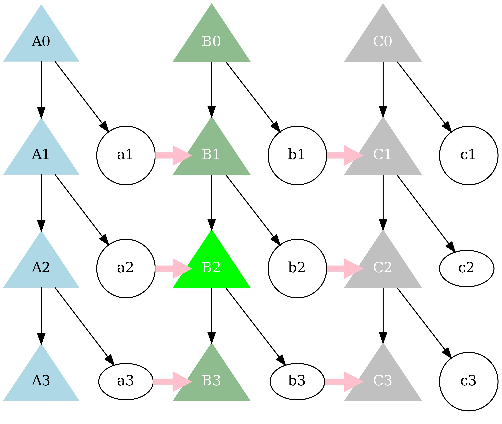

    
     tuu tunda,
     nawu ndeni,
     teta ma'E mbeta,
     towa ma'E papa nggEra,
     kombE weta,
     rhera nara,
     tona iwa ka ono,
     bheka iwa ka rina,

     （エンデの儀礼詩より）

# 結婚──母方交差いとこ婚

 縦の関係（出自の関係──親子関係から派生する関係）について
[前の講義](descend.md)
まででお話ししてきました。
この講義では、横の関係、すなわち結婚
によって生じるシンセキ関係に焦点を移動します。

<!-- BEGIN:LIST -->

★ エンデの親族

- 縦：出自（前の講義）
- 横：縁組（この講義）

<!-- END:LIST -->

## 生まれたときからのシンセキと結婚してからのシンセキ

 若い（まだ結婚していない）読者の念頭には
すぐ浮かばないかも知れない種類のシンセキの区別について、
注意をしておきたいと思います。
それは、「生まれたときからのシンセキと結婚してからのシンセキ」
の区別です。

[ **under construction **  ]

<!-- BEGIN:LIST -->
★ 血族と姻族

- 生まれたときからのシンセキ〜血族
- 結婚してからのシンセキ〜姻族

<!-- END:LIST -->

 子供にとっては、
親にとって「結婚してからのシンセキ」だった人々が、
「生まれたときからのシンセキ」になっています。
これは結婚して、子供が産まれ、
そして、子供がシンセキの子供たちと遊ぶようになって、
あらためて認識させられる不思議な事実です。

<!-- BEGIN:LIST -->
★ 脱線：ヨーロッパの姻族

- 『ハーガー』
- 『ガーフィールド』
- 『ボートの中の三人男』

<!-- END:LIST -->

 [ **under construction ** エンデの場合では ]

## 母方交差いとこ婚

 エンデの出自についての考え方は、
日本でのそれと大きくは違っていなかったので、
日本の出自の考え方からのずれを説明するという方法をとれました。
しかし、婚姻についての考え方は、日本のそれと大きく異なります。
それゆえ、まず、真っ正面からエンデの婚姻の考え方を紹介する事から、
この節をはじめたいと思います。

 この節でも、EGOを男性として話をします。
エンデでは、男は自分の母方のおじの娘と結婚することが
ひとつの規則となっているのです。
「**規則**」という言い方は誤解を招くのですが、
どんな類いの規則かということについてはおいおい述べていきます。

 [ **under construction **  ] 学生の名前をつかってわかってもらう

{width=70%}

<!--
+--------+     +--------+
|        |     |        |
m        f === m        f
|              |
+--------+     +--------+
|        |     |        |
m        f === m        f
|              |
+--------+     +--------+
|        |     |        |
m        f === m        f
-->

## おばのたどった道

 この言い方（母方交差いとこ婚）より、じつは、
エンデの人の言い方の方が分かりやすいのです。
このような結婚をエンデでは、
ンブズ・ンドゥ─・ウェサ・スンダ
と言います。
ンブズとは、「（一種の）道」、
ンドゥ─とは「たどる」、
ウェサは、「（小さな）獣道」、
そして、ウェサとは「つなげる」という意味です。
おおまかな意味は、「**道をたどる**」ということです。
ここでいう「道」とは何なのでしょう。
エンデの人の解題は次のようなものです──
「女は、自分のおば（ノッオ）のたどった道をもう一度たどるのだ」と。

 母方交差イトコ婚は、世代を越えて WG から WT へと女性
が移動する、そのような結婚である。

 MBDM is a marriage by which a WG group
remains WG across generations;
a man, say A, ``gives'' his sister to another man,
B, thus becoming a WG to B.
Now suppose A begets a daughter.
A give his daughter to B's son.
Thus, the house of A has been WGs for two
generations;
once by giving A's sister to B and
then by giving A's daughter to B's son (of B's
house).

 From B's son's point of view, 
A's daughter, his wife, is originally
his mother (A's sister)'s brother (that is, A)'s
daughter, hence the name MBDM.

<!-- BEGIN:LIST -->
★ MBDM

- MBDM is a marriage by which a WG group
	remains WG across generations

<!-- END:LIST -->

 But that (``MBDM'') is not the way
people of Ende express this
type of marriage.
``MBDM'' is a term, as is apparent from
my explanation above, 
coined from the male point of view (B's son);
they (the Endenese people) employ the woman's
point of view ---
it's called ``a marriage of [a woman's] tracing
the path of her aunt''.
It's a FZS's marriage.
A woman is tracing the path which her
aunt (FZ) once went along.

<!-- BEGIN:LIST -->
★ Endenese way of MBDM

- Tracing the aunt (FZ)
- A woman is tracing the path which her
	aunt (FZ) once went along

<!-- END:LIST -->

## 規則

 ある家、たとえば家の WG は世代を越えて一つだけ
となります。言い方を変えれば、母方交差イトコ婚が行な
われなければ、佐々木家に世代毎に違った WG が生まれる、
ということになります。

<!-- BEGIN:LIST -->
★ MBDM is not the only rule

- Ana ArhE --- marriage "by
	sitting and asking" (*ngambE*) (marriage by
	arrangement)
- DhEi Dhato --- Love by themselves (no
	arrangement) 
- Paru DhEko --- elopement (a girl
	running into a boy's house)
- Poi --- Snatching (a girl from a
	running house) (to be followed by fierce *jekE*)

<!-- END:LIST -->

<!-- BEGIN:LIST -->
★ Ana ArhE

- Most privileged type of marriage
	(heaviest bridewealth, *ngawu*) ---
	non-MBDM --- looking for a new alliance
- Looking for a new WG.

<!-- END:LIST -->

## 名称の体系

 エンデの親族名称の体系は

## 練習問題

# もっと勉強してみたい人のために──独断と偏見の文献ガイド

 エンデの親族名称や結婚の仕組みがとても複雑に見えたかも知れません。
ところが、世界のいろいろな場所を見てみると、
エンデよりもっと複雑な名称体系や複雑な仕組みを持っている
人々がいるのです。
レヴィ＝ストロースは『親族の基本構造』([@ls-elementary])という本のなかで、
「彼らは数学的な楽しみのためにこのような複雑な
システムを使っているのではないか」と書いているくらいなのです。
じっさい、『親族の基本構造』の真ん中へんの一章は、
数学者によって書かれています。

 [ **under construction ** 人類学の親族理論、交換理論には ]

 [ **under construction ** ([@nakagawa-dog]) ]

# References

