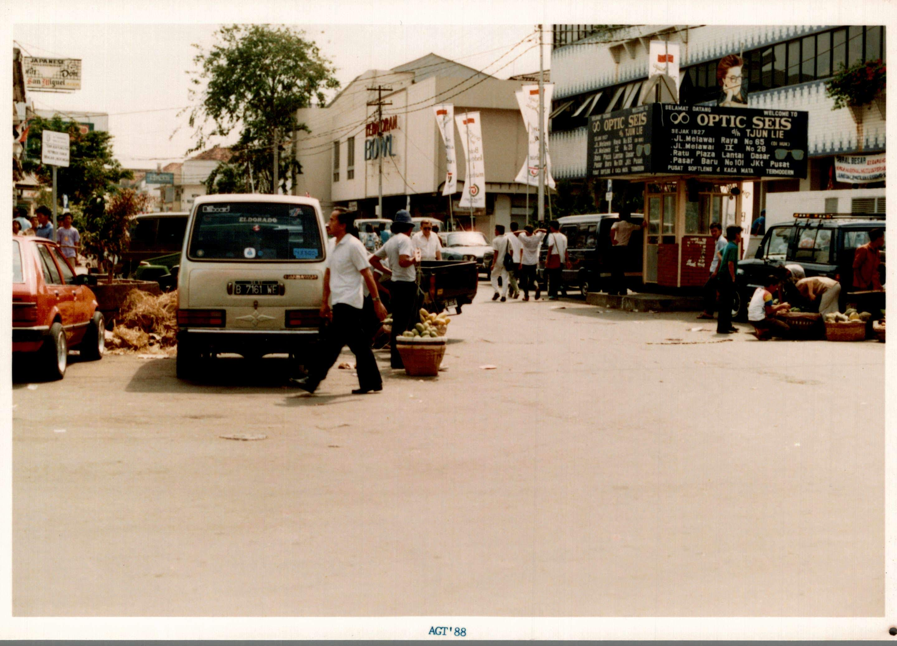
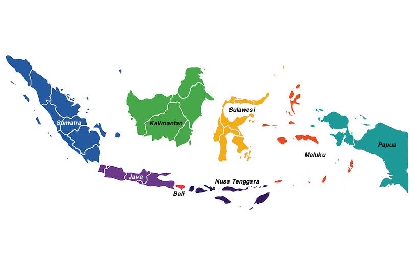

    
divert(-1)

divert

<!---
---
RCS-title: エンデ──入門
RCS-spec: ２００２年度、豊中での「人間科学概論II」授業草稿
RCS-memo: インドネシア、NTT、フローレス、エンデ
RCS-filename: $RCSfile: visit.yaml,v $
RCS-date: Thu Sep 19 17:04:02 2002
RCS-state: $Date: 2008-11-28 03:02:50 $
RCS-revision: $State: Exp $
RCS-something: $Revision: 1.1.1.1 $
RCS-converted-date: 2024-03-25

---
-->

<!-- FL -->
```
ndua ruka nE'E ura,wa'u sambu nE'E epu,---,（エンデの儀礼詩より）

```

# 序

 この一連の講義ではインドネシア東部の
フローレス島に住んでいるエンデという人びとについて
語っていきます。

 「このグローバル化の時代に、
なぜそんな聞いたこともないような人びとについて
学んでいかなければならないのか」と思う人も多いでしょう。
私は次のように答えたいと思います…
このグローバル化の時代だからこそ、
辺境の人びとについて学んでいかなければならないのだ、と。

 [ **under construction **  ]

----

 最初の授業では、雑談風に私のエンデ行を物語っていきます。
いくつかの背景知識を提供します。

# 出国

 １９７８年、私は大学の修士課程を終了し、
博士過程に入学しました。
２３才でした。

 文部省[^FN-1]の
アジア諸国派遣留学という奨学金に応募し、
合格しました。
１９７８年度のインドネシアへの出発が決まりました。
期間は２年間です。

 このころは、
円が弱いので、簡単に海外へ出かけたり、
また、帰国したりはできませんでした。
フィールドワークは「行ったら、終わるまでは帰ってこれない」
という状況だったのです。
人類学者の「通過儀礼」という感覚がありました。
ある先生に「泣いて帰ってくるなよな」と言われたのをまだ覚えています。

 ビザの取得に時間がかかりました、
奨学金の時効ギリギリの１９７９年の３月になってやっとビザが下りました。
３月２７日に出発です。
はじめての海外旅行、はじめての飛行機で、緊張しました。
といっても、いまでも[^FN-2]
外国に出かけるのはおっくうで、飛行機に乗るのは緊張します。
家族に羽田に送ってもらいました。
まるで登校拒否症のようになってしまったのを覚えています。
そのときの写真をみると、
前の日に髪の毛を切ったらしく、
なんだか羽をむしられた鶏のような髪型になっていました。

 乗った飛行機は３月３１日で潰れることの決まっている
飛行機会社のものです。
片道の切符しかないので、とても割安でした。

 窓際の席でした。
窓枠が（古い小学校の教室を思い出させる）
木製だったのが印象的でした。
窓から見える景色のほとんどは、巨大な翼に占められていました。
その翼が大きく揺れているのをみて、
とても心配になりました。[^FN-3]
しばらくすると、天井からポタポタと水滴が落ちてきました。
私は果たして、無事にまた地面を踏めるのだろうか、と心配で心配で、
しょうがありませんでした。

##### インドネシア行き
  
- 1979年3月27日から二年間の滞在
- 92年のビデオ(15分)

# 入国

{width=70%} 

ジャカルタの空港に到着したときは、すでに夜になっていました。
いまでも、ジャカルタの空港に夜に到着すると、緊張しますが、
この時は、「緊張」という言葉では物足りないほどに緊張していました。

 男が近づいてきて、私の荷物をさっとかすめとってしまいました。
いやおうなく、荷物の運ばれたタクシーに乗ります。
運転手がタクシーの中にいたので、相手は二人です。
ホテルに着くまで戦々恐々としていましたが、
しょうしょう高めの値段をふっかけられただけで、
[^FN-4]
無事にホテルに到着です。

 空港で、
異国にはいることの恐怖をたっぷりと味わいました。
いわば、「民族」レベルで、異民族・異言語のこわさを味わったのですが、
国民国家のいやらしさは、それ以上です。

 わたしは、学生ビザで入国したので、
調査をするために調査ビザを取得しなければなりません。
学生ビザでジャカルタの大学に在籍している間、
毎週のようにイミグレーション（移民局）へ通いました。
「書類は受け取っておこう、あした来い」と言われて、
次の日行ってみても、何も進んでいません。
となりの窓口では、書類の間にお札をはさんでいる人がいます。
要するに、お金がなければ、とてつもなく手続きは遅れるのです。

##### 国家ショック
  
- 悪徳タクシー
- 悪徳入管
	_SS_HR
- 役割と人格──「本当の人格」はあるのか？

 これ以上書くのはやめましょう。
私は、べつだん、インドネシアの移民局を弾劾するために
この文章を書いているわけではありません。
留学生の間では、日本のイミグレーションの感じの悪さも
相当なもののようです。
もちろん、これは、日本のイミグレーションで働く人々を
弾劾する文章でもありません。
言いたいことは、国家あるいは国家の境界をバックにすると、
人間はとてつもなく強くなる、ということなのです。
あなたも、私も、国家権力を後ろ楯にすれば、
移民局の窓口でとてつもなくいやな人間になれるのです。

 観光にいって、ちょっぴり田舎にいって、
「ほんとうのインドネシア人に会った」と感動するのも結構です。
外国人観光客たちが「笑顔の日本人」に喜んでいます。
しかし、その同じ「純朴な」「やさしい」人たちが、
ひとたび「インドネシア」人になると、
あるいはひとたび「日本」人になると、
すなわち、国家をバックにすると、
とてつもなく**いやな**人たちになるのだ、
ということを知っておいてほしいと思います。
もう一度言っておきましょう──
あなただって、私だって、権力をバックにすれば、
いつだってそうなる可能性があるのです。
これが、国民国家のいやらしさなのです。

# インドネシア

 私の旅行記はここまでにしておきましょう。
ここからは、インドネシアという国についてお話しすることとします。
──『わたしんち』（第５巻）に出てくるような人もいるかも知れませんから。

## タマン・ミニから

 簡単にインドネシアという国の紹介をしておきましょう。

{width=80%}

 まず知っておいてほしいのは、
インドネシアはたいへん大きな国だ、ということです。

 ジャカルタに
タマン・ミニ（正確にはタマン・ミニ・インドネシア・インダー、
「麗しきインドネシアのミニ公園」）
というテーマパークがあります。
４０数個のインドネシアの州の各州の「文化」「民族」が展示されています。
さらには、池の中にミニチュアのインドネシアの島々が作られ、
モノレールに乗ればインドネシアを一望にできるのです。
モノレールに乗りましょう。
私はガイド役になることとします。

 タマンミニのあるジャカルタのあるジャワ島、
その左（西）のスマトラ島、右（東）のバリ島はよく知られた島々でしょう。
バリの東側にさらに島々が連なっているのが見えます。
バリ、ロンボク、スンバワ、
そしてエンデの人々の住むフローレス島です。
フローレスよりさらに東に島々は広がり、
ニューギニア島まで達しています。

{width=80%}

## 行政区分

 行政的には、インドネシア共和国は、
州知事（グブルヌール）の治める州（プロピンシ）に分かれています。
一つの州は、さらに県知事（ブパティ）を頭に抱く
県（カブパテン）に分かれ、
一つ一つのカブパテンはさらに、
郡（クチャマタン）に分割されます。
クチャマタンには、一人の郡長（チャマット）がいます。
クチャマタンは、行政の末端であるデサ（村）に分かれ、
クパラ・デサ（村長）が各デサに一人います。

##### 行政区分
  
- 州（プロピンシ）：州知事（グブルヌール）
- 県（カブパテン）：県知事（ブパティ）
- 郡（クチャマタン）：郡長（チャマット）
- 村（デサ）：村長（クパラ・デサ）

 ジャワからフローレスにいたる道筋にあるだけの
州の名前だけをあげておきましょう。
ジャカルタはそれだけで、
首都特別地域（特別地域は州と同じ地位をもっています）を構成してます。
[^FN-5]
ジャカルタを取り囲んでいる州が西ジャワ州です。
ジャワ島には、二つの民族が住んでいます──スンダとジャワです。
西ジャワにはスンダの人々が住んでいます。

 西ジャワから東に行くと、
中部ジャワ（その中に、ジョグジャカルタ特別地域があります）、
そして、東部ジャワ州があります。
中部ジャワ、東部ジャワにはジャワ人が住んでいます。
ジャワ島の中で、狭い意味で、「ジャワ」という言葉が使われるのが、
この二つの地域です。

 東ジャワ州でジャワ島は終わり、
バリ島に移ります。
バリ島は一つの州、バリ州を構成しています。
州都はデンパサールです。

 バリの東に横たわる島々はヌサ・トゥンガラ──
「東南の島々」と呼び習わされています。
バリから数えて、東へロンボック島、スンバワ島という島があります。
この二つの島は、「西のヌサ・トゥンガラ」という
州を構成します。

##### ジャカルタからＮＴＴへ
  
- ジャカルタ・首都特別地域 
- 西ジャワ：スンダ人
- 中部ジャワ：ジャワ人（ジョグジャカルタ）
- 東ジャワ：ジャワ人
- バリ：バリ人（ヒンドゥー・バリ）
- 西ヌサ・トゥンガラ（イスラム）
- 東ヌサ・トゥンガラ（ティモール、スンバ、フローレス）

 さらに東へ行くと、
フローレスがあります。
フローレスの南西にスンバ島、
南東にティモール島が横たわっています。
この三つの島で構成されるのが「東のヌサ・トゥンガラ」、
州です。
州都はティモール島のクパンです。

##### 広いインドネシア
  
- サバンからメラウケまで
- 三つの時間帯（最東端と日本）

 さて、しょうしょう急ぎすぎたようです──
インドネシアという国についてもう少しお話ししましょう。

## 広いインドネシア

 インドネシアの広さ
[^FN-6]
をイメージしてもらう作戦はいくつかあるでしょう。
「東西の広さは北アメリカ大陸の東西の広さと
同じです」というのもひとつの方法です。
これだけ（東西に）広い国ですので、時間帯も複数あります。
西から「西インドネシア時間帯」(WIB, Waktu Indonesia Barat)、
「中部インドネシア時間帯」 (WITA, Waktu Indonesia Tengah)、
そして「東インドネシア時間帯」 (WIT, Waktu Indonesia Timur)です。
[^FN-7]

## インドネシアを走る境界線

 このように広い国ですので、
いくつかの世界的規模で有意味な境界線がインドネシアの国内を走っています。
二つだけ例をあげましょう。
ともに、東部インドネシアの中に走っているのです。

##### 地理・生物・外国語
  
- ワレシア線（動物）
- オーストロネジア語族と非オーストロネジア語族（人間）

 ワレシア線は生物学的な線です。
Wallace
[^FN-8]
によって発見された区分です。
この線より南（東）の動物は、
オーストラリア的な特徴を示します。
たとえば、有袋類はこの線の東側・南側にのみ見られます。

 ワレシア線が動物の分布に関する線だとすれば、
人間の分布に関する線が、
フローレスの東を走っている
≪オーストロネジア語族と非オーストロネジア語族の境界≫です。
[ **under construction ** オーストロネジア ]

## 西と東のインドネシア

 簡単にインドネシアの歴史をひもといてみましょう。
[ **under construction ** インドネシアの歴史 ]

##### 西の歴史
  
- マタラム王国 (1502--) と東インドネシア会社 (1602--)
- 独立運動とマジャパヒト (1293--) の発見 （フィリピンとの比較）
- ナショナリズム（ジャワ学の成立）ジャワ・ナショナリズムと普遍主義 (1910)
- インドネシア・ナショナリズムと普遍主義 (1930)
- 第二次大戦・独立戦争
- スカルノ体制
- １９６５年９月３０日共産党蜂起未遂事件
- スハルト体制（オルデ・バル）

 インドネシアの歴史を紹介して、私が強調したい点は、
バリ以西の（バリ、ジャワ、スマトラからなる）西インドネシアと、
バリより東の東インドネシアの間の、
歴史家の興味の違いです。
情報が大きく西に傾いていることがわかっていただけるでしょうか。

##### 西インドネシアと東インドネシア
  
- 面積──西：東：：1：2
- 情報──西：東：：10：1

 面積をもって比較すれば、
東対西（インドネシア）は、１対３くらいの比率だと思います。
ところが、情報の量で比較すれば、
東対西（インドネシア）は、１０対1、あるいは
それ以上のいびつな割合になるのです。

 私がジャカルタに住んでいるときのお話をしましょう。
[ **under construction ** エンダンの家族 ]

 インドネシアの中心部の人々からみれば、
フローレスやその他の東の島々は
それほどに周縁に位置する島なのです。

## 最近の出来事

 ところが、この西偏重の傾向が、
このころのニュース報道の中で変化してきているようです。

 ご存じでしょうが、
１９６５年以来長期安定政権であった
スハルトの政権が、
１９９８年５月のジャカルタでの暴動を境に大きく揺らぎ、
最終的に終わってしまったのです。
最後のスハルト内閣で副大統領であったハビビの大統領就任は
あったものの、
大統領はハビビからグス・ドゥルへ変わり、
現在は（最初の大統領スカルノの娘）メガワティになっています。

##### 最近の出来事
  
- １９９８年５月の暴動
- スハルトの退陣
- ワヒッド体制
- リフォルマシ (reformation)

 スハルト時代の終りから、現在まで様々な問題が山積みしていますが、
その多くが東インドネシアを舞台にしているのです。
アチェの独立問題こそ、西インドネシア（スマトラ）ですが、
ニューギニア、東ティモールの独立問題、
カリマンタン島における原住民とマドゥラからの入植者の争い、
そして、マルクのアンボン島におけるイスラムとクリスチャンの争い、
これらすべて東インドネシアで起こっていることです。

##### 東インドネシアのかかえる問題
  
- アチェ（スマトラ北部）
- ニューギニア問題（ニューギニア島）
- 東ティモール（ティモール島）
- カリマンタン島
- マルク（アンボン島）（宗教問題）
- バリの爆発

 東インドネシアでの「問題」の報道がおおくなったことが、
どういうことを意味しているのかは、よくわかりません。
ともかく、
「中央」の人たちにも、
東インドネシアの存在が知られるようになってきたことだけは
たしかでしょう。
しかし、それは
「東インドネシアでは、最近になって、
それも『問題』となるようなことだけが起きている」
という理解かもしれません。
そのような理解は事実とかなりずれています。

 むかしから、東インドネシアは、（いわば）
「歴史の舞台」であったのです。

 [ **under construction **  ]

##### エンデは辺境か
  
- 漂海民（バジャウ）（フィリピン、ブルネイ、マレーシア）
	_SS_HR
- 『なまこの眼』（ブギス）（アル島、オーストラリア、香
	港）
- 白檀（サンダル・ウッド）（ティモールからオーストラリ
	ア）
- 赤道交易（キャサッバ）
- 海賊（スンバのエンデ村）（cf: ブギス）（奴隷貿易）
	_SS_HR
- 東廻りの労働移民（レンバタ・ウジュンパンダン・パレ
	パレ・カリマンタン）
- 西廻りの労働移民（エンデ、スラバヤ、ジャカルタ、ス
	マトラ、マレーシア半島）

# ジャカルタ

 タマンミニのモノレールから降りましょう。
あなたは、自分が神の座ではなく、
ジャカルタにいることに気付くでしょう。

 ジャカルタはインドネシアの首都です。	

 インドネシアの他の地域をよく知っている人たちが
ジャカルタについて語るときの二種類の語り方があります──
「ジャカルタはインドネシアではない」そして、
「ジャカルタにだけインドネシアがある」と。
どちらも同じこと（「ジャカルタはインドネシアの他の地域と違っている」）
ということを言おうとしているのでしょうが、
私には後者の言い方がよりしっくりきます。
インドネシアの領土の中には、多くの民族が暮しています。
言語も多様です。
そこに国民国家ができたのですが、
国民国家としての「インドネシア」がもっともよく見えるのは、
やはりジャカルタが群を抜いていると思います。

##### ジャカルタ
  
- ジャカルタはインドネシアではない
- ジャカルタにしかインドネシアはない

 それでは、ジャカルタを少し案内してあげましょう。
ジャカルタはオランダの来る前までは、
スンダ・クラパという小さな漁港だったそうです。
その漁港が現在では、ジャカルタの海の玄関口、
タンジュン・プリオック港となっています。

 ジャカルタがバタヴィアであったころ、
まず栄えたのが、現在のジャカルタの北部、コタ（「町」）
と呼ばれている部分です。
現在、コタはむしろ中国人街として知られています。
1998年5月の暴動で、コタは壊滅してしまいました。
少しずつ回復しているものの、
まだまだ往年の繁栄を取り戻すまでには至っていません。


<!--

{width=35%}
{width=35%}
{width=35%}
{width=35%}
{width=35%}
{width=35%}

-->

 現在ジャカルタの繁華街は
北から南に移ってきています。
大使館やビジネス街、
そして、プラザと呼ばれる豪華なショッピングセンターのあるのが、
ジャカルタの中央部です。

<!--

{width=35%}
{width=35%}

-->

 ジャカルタ中央部に、超高級住宅街メンテンがあります。
しかし、大半の高級住宅は、より涼しい南部に位置しています。
その中でももっとも古いのがクバヨラン・バルでしょう。
次の写真は、クバヨラン・バルの近くの商店街、ブロックＭのものです。

<!--

{width=35%}
{width=35%}

-->

 「ジャカルタにしかインドネシアはない」と先ほど言いました。
インドネシアについてしばらく書いてみましょう。

 [ **under construction ** 民族ステレオタイプ ]

##### 民族ステレオタイプ
  
- マドゥラ
- バタック
- ミナン
- ジャワ

 「インドネシア」の独特さ

##### 「インドネシア」
  
- インドネシアのシンボル：ワヤン、テンペ
	_SS_HR
- 国民料理と民族料理：ナシ・ゴレン、ミー・ゴレン
- そこら中にある料理：パダン
	_SS_HR
- 国民音楽と民族音楽：クロンチョン
- そこら中にある音楽：ポップ

 [ **under construction ** ナショナリズム作文 ]

# バリ

 また私の１９７９年の道行きに戻りましょう。
ティモールの争乱が始まっています。
ティモールは、軍の区分で言うと、バリの管轄下にあるのです。
というわけで、私はティモールに行くための許可を
バリにある軍からもらわなければいけなかったのです。

 私はバリに一週間ばかり滞在することになりました。

 いまでも、飛行機の関係で、
ジャカルタからフローレスにまっすぐはいけません。
ジャカルタからフローレスへ行くには、
まずバリ島を経なければなりません。
『最後の楽園バリ』は、
このセールストークに負けないすばらしいところです。

<!--

{width=35%}
{width=35%}

-->

# もっと勉強してみたい人のために──独断と偏見の文献ガイド

 各講義の最後に、
このような「もっと勉強したい人のために」という節をもうけます。
それぞれの文献の後ろについている星印は難易度を表しています。
★★★は高校生にも読めるもの、
★★は大学生程度、
そして、★は大学院生以上を対象にしたものをあらわしています。
星印のつけ方から分かってもらえると思いますが、
私は、高校生にも読めるものを大学院生を対象としたものより
高い位置においています。
難易度は、内容とは関係していません。

 私の<!---[@nakagawa-sakubun]-->（★★）は、
１９８０年代のインドネシアの政府、
あるいは政府よりの文章を分析した論考です。

 私の<!---[@nakagawa-nationalism]-->（★）は、
ナショナリズムについての理論的な議論です。
その中で、インドネシアのナショナリズムの形成史をひとつの例として
とりあげています──
ナショナリズムに興味のある人はぜひ読んでみてください。

 ナショナリズムに関する本は星の数ほどあります。
政治学者の書いたものを読む時間があれば、
新聞記事を読んだ方がいいと個人的には思っています。
しかし、ナショナリズムに関する早すぎる古典
[^FN-9]
<!---[@anderson-nationalism]-->（★）はすべての大学院生に
読んでもらいたい本です。

 インドネシア・ジャカルタの混血文化に関してはおもしろい文献が
たくさんあります。
その中でも**いちおし**は、
美文調で美文について語り、
ノスタルジックな語り方でノスタルジーについて語る、
名著<!---[@tsuchiya-kartini]-->（★★★）です。
涙なくしては読めません。

 インドネシアの地方都市についてのおもしろい文献は、
残念ながら、私の知っている範囲ではありません。
もう少ししっかり探してみます。

# References

<!-- Verfsion Up History 
```

$Id: visit.yaml,v 1.1.1.1 2008-11-28 03:02:50 satoshi Exp $
$Log: visit.yaml,v $
Revision 1.1.1.1  2008-11-28 03:02:50  satoshi

Revision 1.3  2006/01/08 02:36:06  satoshi
２００５年年末から２００６年の正月にかけて、浦和での作業

Revision 1.2  2005/12/15 07:35:39  satoshi
FOTO1 に関するバグを削除。（暫定的）

Revision 1.1.1.1  2004/10/11 07:15:38  satoshi
Initial import.

Revision 1.6  2004/07/01 11:17:33  satoshi
From Psmith.

Revision 1.5  2004/06/08 12:02:03  satoshi
一人旅にした。

Revision 1.4  2004/06/08 02:20:04  satoshi
画像の位置を変更。

Revision 1.3  2004/06/08 00:07:33  satoshi
画像の位置を変更。

Revision 1.2  2003/11/03 00:24:59  satoshi
typo をなおした。

Revision 1.1.1.1  2003/04/26 08:00:36  satoshi
New cvs-repository (2003.04.26)

Revision 1.3  2002/12/21 09:30:10  satoshi
ディレクトリーの名前の間違いを修正。

Revision 1.2  2002/12/03 07:38:14  satoshi
ディレクトリー変更にともなう Navig による修正。

Revision 1.1  2002/12/01 11:22:26  satoshi
Moved from a deeper directory.

```
-->

<!-- Verfsion Up History 
```

Revision 1.6  2002/10/29 07:50:43  satoshi
エンデの儀礼詩からの引用で各講義をはじめることとした。

Revision 1.5  2002/10/29 03:01:53  satoshi
通過儀礼としてのフィールドワーク。

Revision 1.4  2002/10/19 15:25:42  satoshi
行志向への変更中。
エンデの町についての記述を付け加えている。

Revision 1.3  2002/10/15 13:05:07  satoshi
小見出（UL）を入れた。あした授業。

Revision 1.2  2002/10/14 15:08:38  satoshi
明後日が授業──大幅な書き加え──完成に近づいたと思う。

Revision 1.1  2002/10/09 14:50:16  satoshi
まず、枠組みだけを作成した。

Revision 1.3  2002/09/25 21:41:19  satoshi
ビザ取得から出発まで。

Revision 1.2  2002/09/21 09:33:05  satoshi
イントロを数行書き込んだ。

Revision 1.1  2002/09/19 21:32:55  satoshi
エンデ──入門

```
-->

[^FN-1]: 現「文部科学省」。

[^FN-2]: ２０年以上たった、
２００２年の９月にこの文章を書いています。

[^FN-3]: あとから工学部の人に話を聞きましたが、
飛行機の翼というものは揺れるようにできているそうです。
揺れないと、折れてしまうということです。

[^FN-4]: とてもびくびくしていたので、彼らも、「これ以上おどしても
おもしろくない」と思ったのではないでしょうか。

[^FN-5]: １９９７年の統計で、９７０万人です。
現在はおそらく１０００万人を突破しているかも知れません。
大阪府（８６０万人）より人口は多く、
東京（１１５７万人）より少しだけ少ないのです。

[^FN-6]: １９０万４５６９km2です。
人口は、１９９８年の統計で、２億人を少しだけ越えています
（２億２９６万人）。

[^FN-7]: 広さとは直接関係ありませんが、
WIT と日本標準時が同じであることを付け加えておきます。
日本から真南に線をひけば、インドネシアの東の部分、
だいたいニューギニアに、ちょうどぶつかるのです。

[^FN-8]: ウォーレス (Alfred Russel Wallace)
【生物】 (1823-1913) 英国の博物学者。1854年よりマレー諸島で生物の分布を研
究し，のちにウォーレス線と命名された生物境界線を提唱。また同諸島滞
在中の1858年C.ダーウィンとは独立に自然淘汰説に基づく進化論
に到達。この論文はリンネ学会でダーウィンの論文と一緒に発表され，進化論確立
の基礎となった。主著は《マレー諸島》 (1869年)，《ダーウィニズム》 (1889年
) ほか。（マイペディアより）

[^FN-9]: 古典となるのが早すぎたという意味です。
いろいろな論文の中で、この本が引用されているのですが、
引用のされ方が一種の**免罪符**のような引用のされかたなのです。
「だって、アンダーソンがこう言っているんだから、文句は言わないでくれ」
とでもいいたげな引用なのです。
むしろ、批判的に読むことによってこそ得るものが大きい、
そのような本だと私は思っています。
